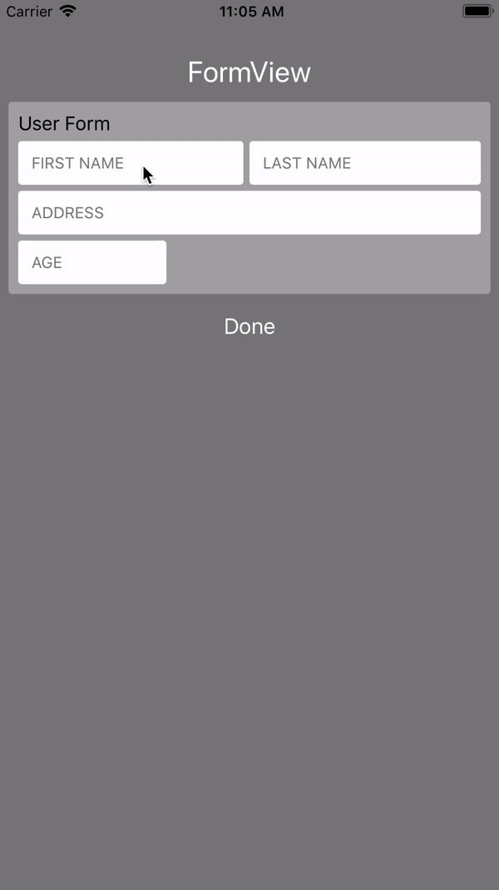
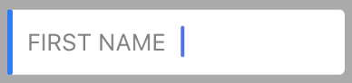
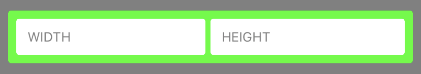
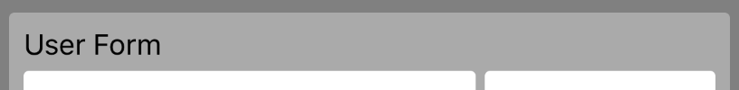
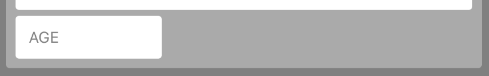

<div style="text-align:center"></div>

#  GenericUI

[](https://travis-ci.org/tlextrait/GenericUI)
[](http://cocoapods.org/pods/GenericUI)
[](http://cocoapods.org/pods/GenericUI)
[](http://cocoapods.org/pods/GenericUI)

GenericUI provides you with beautiful and generic UI elements for your iOS projects. For now it just focuses on inputs and forms but there's a lot more to come.

## Contents
* [GenericUI](#genericui)
    * [Requirements](#requirements)
* [Components](#components)
    * [Inputs](#inputs)
    * [Forms](#forms)
* [Examples](#examples)
    * [Input for a `String`](#input-for-a-string)
    * [Input for a `UInt`](#input-for-a-uint)
    * [Input for a custom object `T`](#input-for-a-custom-object-t)
    * [Customize the `UIActiveInput`](#customize-the-uiactiveinput)
        * [Styles](#styles)
        * [Text Input Delegate](#text-input-delegate)
        * [Touch Events](#touch-events)
        * [Accessibility](#accessibility)
    * [A Simple Form](#a-simple-form)
        * [Form for CGSize](#form-for-cgsize)
        * [Handling Errors](#handling-errors)
        * [Adding a native input to a form](#adding-a-native-input-to-a-form)
        * [Adding a view to a form](#adding-a-view-to-a-form)
        * [Customizing form element sizes](#customizing-form-element-sizes)
        * [Spacers](#spacers)
* [Upcoming](#upcoming)
        
## Requirements

* Swift 3.0+
* iOS 9.0+

# Components

Only a few components are available at this time. They're super customizable and should enable you to save a lot of time and code.

## Inputs
### `UIInputField<OutputType>`

This is a very simple generic extension to the `UITextField`  that attempts to convert the input to the generic type.

### `UIActiveInput<OutputType>`

This is a more sophisticated input that combines multiple views, based on the `UIInputField<OutputType>`. It is highly customizable
but by default comes with a nice design, a label, an animated indicator showing if the input is active and more. It exposes the raw
text field's API including accessibility features.

## Forms
### `UIQuickForm<ModelType>`

A simple component that allows you to build beautiful forms that can gather a generic type of model from the user for you. `UIQuickForm` takes
care of all the layout for you.

## more...
a lot more to come...

# Examples

## Input for a `String`

The code below will make an input labeled "Firstname". It allows the user to enter text and the output will be a `String`.

```swift
let input = UIActiveInput<String>("Firstname")
addSubview(input)
let firstname: String = input.output // returns String?
```

## Input for a `UInt`

Below is an example of an input that gathers an unsigned integer from the user. The ouput is a `UInt`. The `UIActiveInput` is
smart and automatically sets the keyboard to a numeric pad with no decimal point.

```swift
let input = UIActiveInput<UInt>("Age")
addSubview(input)
let age: UInt = input.output // returns UInt?
```

## Input for a custom object `T`

You may gather your own type of model from a `UIActiveInput`, however it will need to conform with a couple protocols,
namely: `StringTwoWayConvertible` and `BestKeyboardType`. The purpose of these protocols is to ensure your object provides
a way to be converted to and from a `String` (since `UIActiveInput` is based on top of the native `UITextField`) and
specifies the best type of iOS keyboard to be used. The `StringTwoWayConvertible`  is a way for you to provide a custom
String transform.

Using extensions, you may also enable existing or third party types to be returned by the `UIActiveInput`.

Example:

```swift
class MyCustomType : StringTwoWayConvertible, BestKeyboardType {
    var number: Double
    
    init?(_ text: String) {
        // Write your own String -> Object transform
        guard let n = Double(text) else {
            return
        }
        number = n
    }
    
    var description: String {
        // Write your own Object -> String transform
        return "\(number)"
    }
    
    static var bestKeyboardType: UIKeyboardType {
        return .decimalPad
    }
}

let input = UIActiveInput<MyCustomType>()
```

## Customize the `UIActiveInput`



`UIActiveInput` is deeply customizable and is built right on top of the native `UITextField`. It is essentially a `UIView` that wraps
a `UILabel`, a `UITextField` and a `UIView` used to show whether the input is active or not.

### Styles

Here are some of the properties you have access to that allow you to customize the style:
* `input.label` exposes the `UILabel` object, which you may directly customize or even remove.
* `input.inputColor` is the background color of the text field.
* `input.backgroundColor` is the background color of the whole element.
* `input.activeColor` is the color of the little vertical indicator, blue by default.
* `input.indicatorWidth` is the width of the active indicator, 2.0 by default.
* `input.forcedLabelWidth` allows you to force the label to be a certain width. This is useful when you have multiple inputs and you want the left edge of all text fields to align.
* `input.placeHolder` sets the placeholder for the text input.
* `input.font` sets the font for the text input.
* `input.textColor` sets the text color for the text input.
* `input.layer` gives you access to the design layer of the whole element if you'd like to make deeper customizations.
* `input.inputLayer` gives you access to the design layer of the text input.
* `input.keyboardType` lets you set a keyboard type for the text input (note this is always set automatically, but you may override it by setting it manually).
* `input.layoutMargins` lets you customize the margins within the element (space between the label and text input from the edges of the `UIActiveInput`).

*A lot more that I can't list here...* `UIActiveInput` is a subclass of `UITextField`, which is a sublcass of `UIView` so all the properties and methods you
expect to find on those you will find on `UIActiveInput`.

### Text Input Delegate

`input.delegate` lets you designate a delegate for the embedded text field.

### Touch Events

By default, the text field will become `firstResponder` if the user taps anywhere on the `UIActiveInput`, including the label. You may also do so
programmatically by simply calling `input.becomeFirstResponder()` and `input.resignFirstResponder()`.

### Accessibility

The `UIActiveInput` provides you with all the standard accessbility functionality and relays all those calls to the embedded text input
(blind users should "see" the `UIActiveInput` the same as a regular `UITextField`).

## A Simple Form

### Form for CGSize



Here's an example of a very simple form with two inputs in it. The goal of this form is to collect a `CGSize`, one input for the width and one for the height.

```swift
class ViewController : UIViewController {

    override func viewDidLoad() {
        super.viewDidLoad()
        
        //...
        
        let form = UIQuickFormView<CGSize>()
        view.addSubview(form)
        
        // Form styling and layout
        form.backgroundColor = .green
        form.layer.cornerRadius = 3.0
        form.translatesAutoresizingMaskIntoConstraints = false
        form.topAnchor.constraint(equalTo: view.layoutMarginsGuide.bottomAnchor, constant: 10.0).isActive = true
        form.leadingAnchor.constraint(equalTo: view.layoutMarginsGuide.leadingAnchor, constant: 8.0).isActive = true
        form.trailingAnchor.constraint(equalTo: view.layoutMarginsGuide.trailingAnchor, constant: -8.0).isActive = true

        let widthInput = UIActiveInput<CGFloat>(label: "WIDTH")
        let heightInput = UIActiveInput<CGFloat>(label: "HEIGHT")

        // Bind the inputs
        let widthInputId = form.bind(input: widthInput) { (size: inout CGSize, input: UIActiveInput<CGFloat>) in
            guard let width = input.output else {
                // handle any errors here
                return (false, nil)
            }
            size.width = width
            return (true, nil)
        }
        let heightInputId = form.bind(input: heightInput) { (size: inout CGSize, input: UIActiveInput<CGFloat>) in
            guard let height = input.output else {
                // handle any errors here
                return (false, nil)
            }
            size.height = height
            return (true, nil)
        }

        // Lay out the inputs in the form (both inputs go on the same line here)
        form.addRow([FormElement(widthInputId), FormElement(heightInputId)])
        form.setRecommendedContentPriorities()
        form.build() // sets up autolayout constraints for all the views within the form

        // When you want to resolve the form to a CGSize:
        var size = CGSize(width: 0, height: 0)
        let success = form.resolve(model: &size)    // returns a tuple (Bool, [Error])
    }
    
}
```

### Handling Errors

Create your own error types for handling bad user input. Error handling is done at the binding.
When the form is resolved you can obtain an array of all the errors.

```swift
enum PersonError : Error {
    case tooOld, nilInput
}
...
let ageId = form.bind(input: ageInput) { (person, input) in
    guard let age = input.output else {
        return (false, PersonError.nilInput)
    }
    if age > 120 {
        return (false, PersonError.tooOld)
    }
    person.age = age
    return (true, nil)
}
...
let success = form.resolve(model: &person)
// success is a tuple (Bool, [Error])
if success.0 {
    // everything looks good!
} else {
    for error in success.1 {
        ...
    }
}
```

### Adding a native input to a form

You may add any kind of input to the `UIQuickFormView`, including native and third party.

```swift
let textInput = UITextField(frame: .zero)
let inputIndentifier = form.bind(input: textInput) { (..., input: UITextField) in
    guard let text = input.text else {
        ...
    }
    ...
}
form.addRow([..., FormElement(inputIndentifier), ...])
```

### Adding a view to a form



You may add any kind of view to the `UIQuickFormView`.

```swift
let label = UILabel(frame: .zero)
let viewIndentifier = form.bind(view: label)
form.addRow([..., FormElement(viewIndentifier), ...])
```

### Customizing form element sizes


You may customize how much horizontal space every element takes within a line of the form.
The default size value is `1`. If all the elements in a row are the same size number then they'll
each take an equal share of the horizontal space.

```swift
form.addRow([FormElement(input, size: 2), FormElement(view, size: 1), ...])
```

### Spacers



`UIQuickFormView` provides an easy way to create spacers.

```swift
form.addRow([FormElement.makeSpacer(size: 3), FormElement(view, size: 1), ...])
```

# Upcoming

* At this time it is not possible to know if there are input errors until form resolution. A feature that tells the calling code if there is an error as inputs are changed is coming soon. The form will expect a binding as well as an optional validator for every input.
* Generic modals.
* Generic table views and table view controllers.
